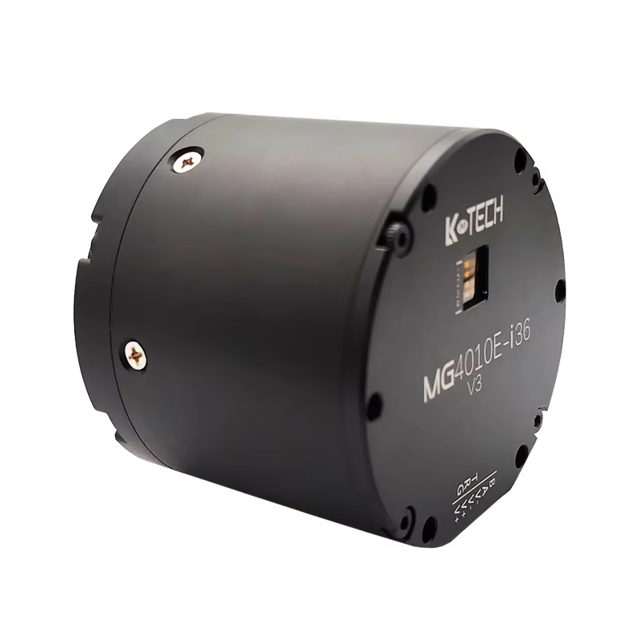

# Motor

## Motor SPECs
- **Brand**: LK Technology (www.lktech.cn)
- ​**Model**: MG4010E-i36v3
- ​**Rated Voltage**: 24 V
- ​**Max Speed**: 90 rpm
- ​**Rated Torque**: 9 N.m
- ​**Rated Speed**: 72 rpm
- ​**Rated Current**: 3.5 A
- ​**Max Power**: 135 W
- ​**Max Torque**: 18 N.m
- ​**Speed Constant**: 3 rpm/V
- ​**Torque Constant**: 2.58 N.m/A
- **Link to Purchase**: [Taobao](https://item.taobao.com/item.htm?_u=j2m1kl5m1a86&id=745925610253&pisk=giCzsLYzK7Fz2N-JEsOE3KqPs-dJ6Br_x6tB-wbHP3xupUNnTw7MRzELyt8hAiULyQ_HYMSXDXTQekhF0g_GFLsCFHYHmibSNHNJLM71XMGQwTTnTi_pKM1FJX8h-MUJAzefyadptlZ1Y5_Ry-X0ERfyrncckehHx-9oUS77llZ_1WyooBrzfgMON-ND7FAHrpYnor8BRDDhxLVDinLp-0YnZrz2DFknEHv3ijYHSBmkxUVDnFT6rHvHrn42JnxHtBjHir8KNyfhIm8BEykwGgxQ9Lvyjaxq_NC2rHkRznlZssW2dhV60XchgU7jJvpS_JtGB396jiVjaB7D8gtfj5c2idWOReSzabA5ntCJNsZZWLSeVdfH30Dk7Q-yI_vxRXQJKt52N_qKBZ_2qdRfh-EWdQSPBhpuHoIFu3shaKmzcH61l_vVjoGVvpWOReSzabjG4fmpo4659TonLLYvuha4uicutYcDtFNIpvpBkE-_rLDKpKD9uhaS9vHpnvY2fzv1.&spm=a1z09.2.0.0.6cbd2e8d9GRzOi&sku_properties=1627207%3A33138125775) | [AliExpress](https://www.aliexpress.com/item/3256806002443731.html?gatewayAdapt=4itemAdapt) | [Amazon](https://www.amazon.com/MG4010E-i36-Deceleration-Encoder-Robotic-Steering/dp/B0DNYSN79K?th=1)

